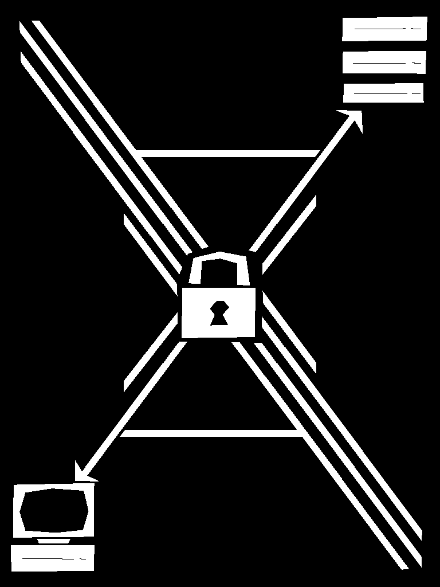

> work in progress

# XASEMOTE

 

A module to help secure data for games on Roblox. Primarily designed for RemoteEvent security.

## Functions 

### `<packet: table> xasemote.pack(keyOrPlayer: string|Player, data: string)`

`keyOrPlayer` can be either a Player or a string. If a Player instance is passed in, it will be used to generate a key using `xasemote.genkey`. If the key is `nil` and XASEMOTE is ran on the client, the key would default to LocalPlayer, otherwise it will error.

`data` will be converted into a string implicitly, via `tostring`.

The returned packet will have 7 items:
1. Ciphertext
2. Hash for plaintext
3. Hash for ciphertext
4. Hash for key
5. Unix time (encrypted)
6. Hash for unix time 
7. Hash for unix time (encrypted)

### `<data: string> xasemote.unpack(keyOrPlayer: string|Player, packet: table, [acceptedUnixL: number], [acceptedUnixR: number])`

`keyOrPlayer` has the same mechanics as in `xasemote.pack`.

The `packet` must have the same structure as in `xasemote.pack`, otherwise the function will error.

Several checks are done using hashes and unix time. If one verification fails, the unpacking ends with an error message, describing which verification failed.

`acceptedUnix[X]` parameters are used to prevent replay attacks.

Current time should not be earlier than `packet.unixtime - acceptedUnixL` nor later than `packet.unixtime + acceptedUnixR`.

`acceptedUnixL`'s default value is 60.
`acceptedUnixR`'s default value is 120.

`packet` must not have a metatable assigned to it.

### `<hash: string> xasemote.hash(input: string)`

Sum-based checksum function with the use of `sin(sin(x)x)x` and `string.pack`.

### `<ciphertext: string> xasemote.encrypt(plaintext: string, key: string)`

XOR-based encryption function.

### `<plaintext: string> xasemote.decrypt(ciphertext: string, key: string)`

XOR-based decryption function.

### `<key: string> xasemote.genkey(player: Player)`

Key generator, that uses session-specific properties, such as Place ID, Server ID and Player info.
